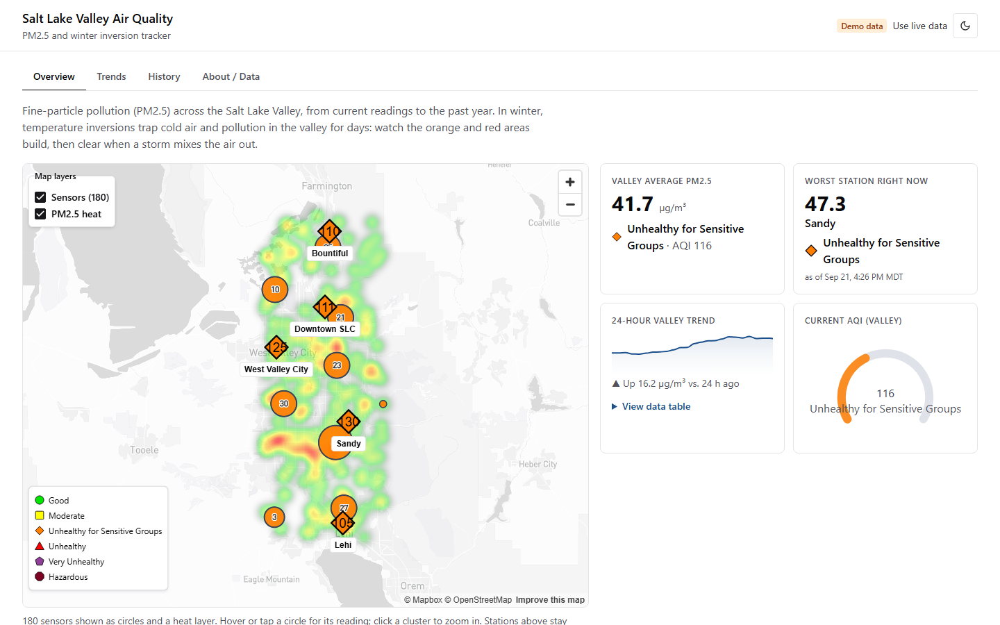
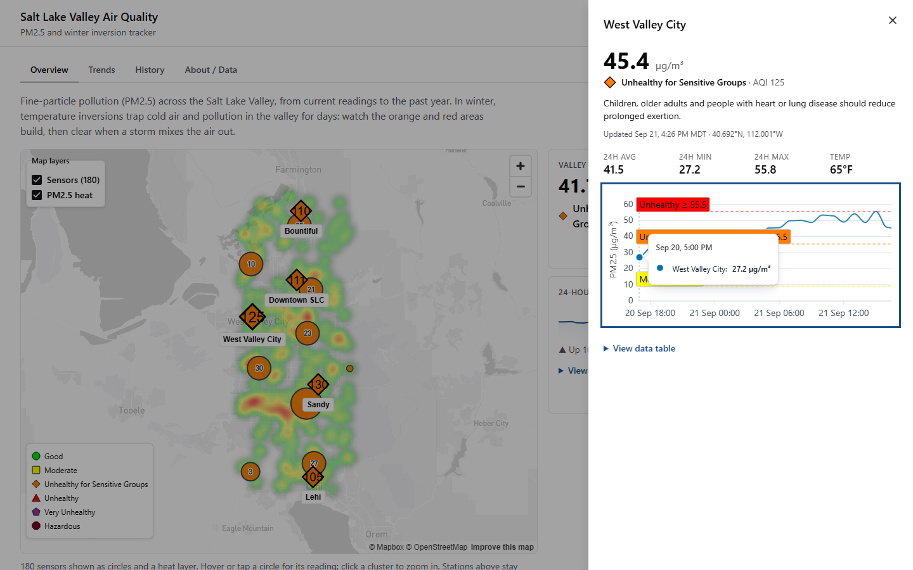
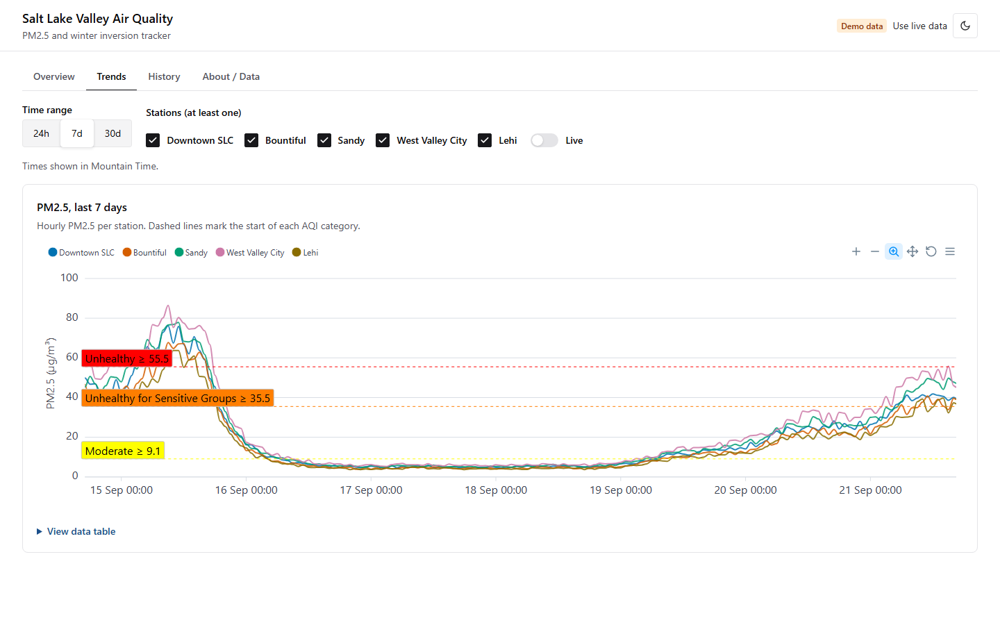
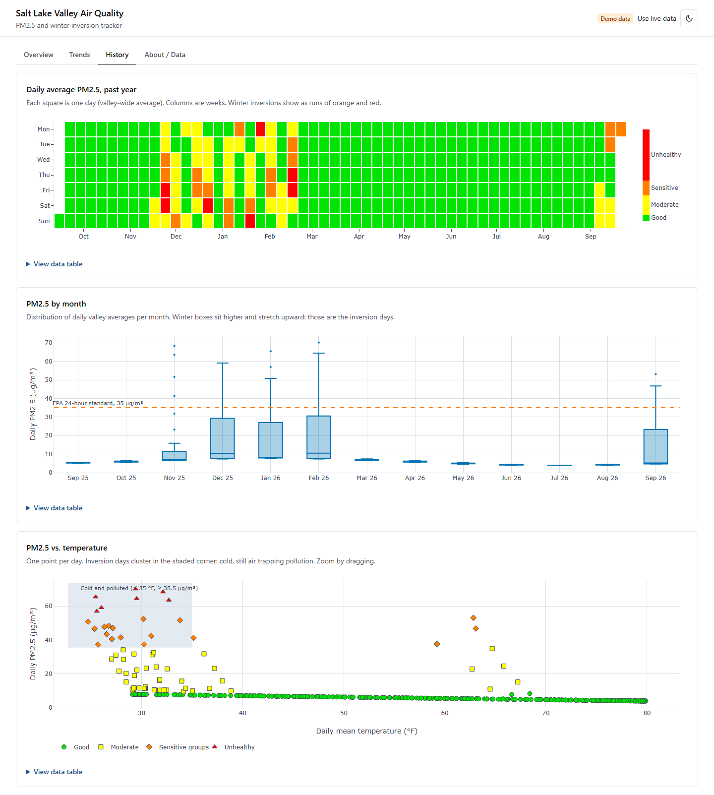
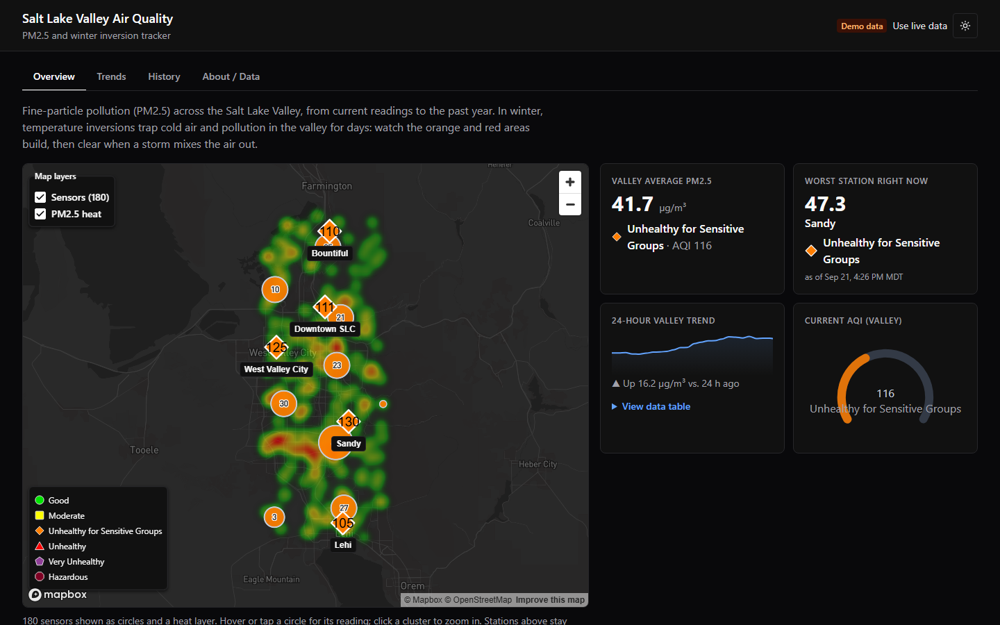
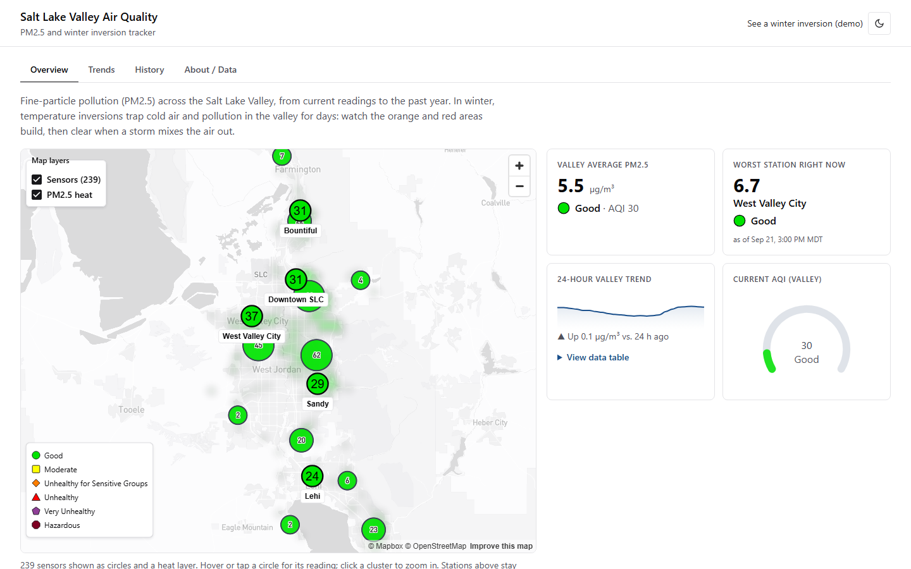
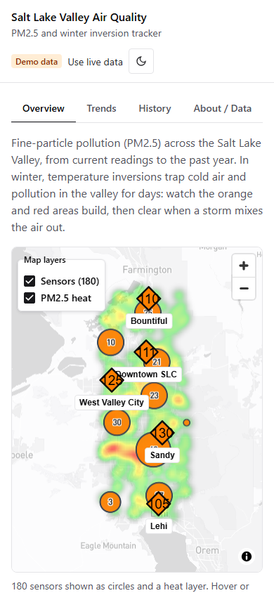
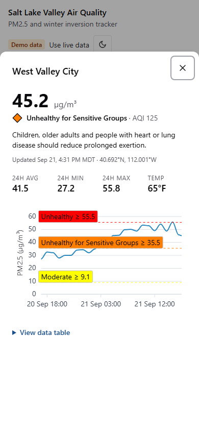

# Salt Lake Valley Air Quality & Inversion Tracker

[](https://github.com/nathanfarr89/slc-air-quality-tracker/actions/workflows/ci.yml)

A React + TypeScript dashboard for current and historical PM2.5 across the Salt Lake Valley, built around
winter inversion episodes. It runs out of the box on keyless data (Open-Meteo) or fully offline on
inversion-shaped fixtures.

**Live:** https://slc-air-quality-tracker.vercel.app (real PurpleAir sensors via a server-side proxy)
· **Winter inversion demo:** https://slc-air-quality-tracker.vercel.app/?demo (simulated data, so the app's core
story is visible in any season; the header shows a "Demo data" badge and a link back to live data)

**Views:** Overview (map, KPI cards, station drawer) · Trends (Apex time series, range + station filters, live
polling) · History (Plotly: calendar heatmap, monthly box plot, PM2.5-vs-temperature scatter) · About/Data
(sources, methodology, AQI legend).

## Screenshots

Captured from the deployed site. All but the last desktop shot use the `?demo` data (a multi-day inversion that
builds, clears, and builds again, plus 180 simulated sensors); the "live" shot is real PurpleAir data.

**Overview: map layers, KPI cards.** A GeoJSON source with clustering and a heatmap layer, colored by AQI category;
station markers are real buttons.



**Station drawer.** Opens from a marker (or the table), with 24-hour stats and an Apex chart with AQI guides.



**Trends.** Apex time series: an inversion building, clearing, and building again (dashed lines mark AQI categories).



**History (Plotly).** Calendar heatmap, monthly box plot, and PM2.5 vs. temperature.



**Dark mode.** One token set drives Chakra, Apex, Plotly and the Mapbox basemap.



**Live data.** Real PurpleAir sensors (in September the valley is mostly "Good").



**Mobile.**

<p>
  
  
</p>

## Setup

```bash
npm install
cp .env.example .env.local   # then edit
npm run dev
```

| Script              | What it does                            |
| ------------------- | --------------------------------------- |
| `npm run dev`       | Vite dev server                         |
| `npm run build`     | Typecheck, then production build        |
| `npm run typecheck` | `tsc --noEmit` (strict)                 |
| `npm run lint`      | ESLint (typescript-eslint, react-hooks) |
| `npm run format`    | Prettier                                |
| `npm test`          | Vitest + React Testing Library          |

### Environment variables

| Variable                   | Purpose                                                                                                                   |
| -------------------------- | ------------------------------------------------------------------------------------------------------------------------- |
| `VITE_MAPBOX_TOKEN`        | Mapbox public token. Without it the map is replaced by an explanatory message; the station table still works.             |
| `VITE_USE_MOCK_DATA`       | `true` serves offline fixtures (a cleared inversion plus one still building, and winter episodes for the past year).      |
| `VITE_MOCK_SENSOR_COUNT`   | Mock mode only: number of simulated map sensors (default 180). Try 5000 to stress-test the map layers.                    |
| `VITE_PURPLEAIR_PROXY_URL` | Production: `/api/purpleair`. Routes PurpleAir calls through the server-side proxy (highest priority after mock mode).    |
| `PURPLEAIR_API_KEY`        | Production, server-only (no `VITE_`): the PurpleAir read key used by the proxy function.                                  |
| `VITE_PURPLEAIR_API_KEY`   | **Local development only**: a direct PurpleAir read key. Visible in the browser bundle, so never set it on a public host. |

`.env.local` is git-ignored; `.env.example` contains no secrets. Note that any `VITE_*` value is embedded in the
client bundle, so use a URL-restricted public Mapbox token.

## Architecture

```
src/
  api/          Provider interface + adapters. The only code that knows where data comes from.
    types.ts        Station, Reading, SeriesRange, AirQualityProvider
    aqi.ts          EPA PM2.5 → AQI/category/color/shape (pure, tested)
    openMeteo.ts    Open-Meteo Air Quality + Weather/Archive adapter
    mock.ts         Deterministic inversion-shaped fixtures
    purpleAir.ts    PurpleAir adapter (EPA correction, A/B QC, area aggregation), disabled without a key
    index.ts        createProvider(): the one place a source is chosen
  hooks/        TanStack Query hooks (useStations, useTimeSeries, useHistory) + live-append hook. No JSX.
  lib/          Pure derivations (KPIs, daily means, calendar grid, quartiles) and Mountain-time formatting.
  theme/        Chakra system with semantic tokens, color-mode provider, useChartColors().
  components/   Shared UI: DataState, ChartCard, ChartTable, AqiGlyph, PmChart.
  features/     overview/ trends/ history/ about/   (colocated views)
```

- **Single service layer.** Views call hooks; hooks call `provider`; adapters implement `AirQualityProvider`.
  Swapping in PurpleAir or AirNow/UDEQ means writing one adapter and changing one line in `api/index.ts`.
  The PurpleAir adapter rejects with a typed `ProviderDisabledError` when no key exists.
- **Failure containment.** `ErrorBoundary` (a dependency-free class component) sits at three levels: the whole app
  (full-page fallback), each view (resets when you switch tabs, so a crashed view never traps you), and around the
  map (WebGL or Mapbox failures leave the rest of the Overview working). A failed lazy chunk, usually after a new
  deploy, offers "Reload page" instead of a useless retry. It has an `onError` hook ready for error reporting.
  Boundaries catch render errors only; data-fetch errors are handled by `DataState`.
- **Explicit data states.** `DataState` handles loading, error (with retry), empty, stale (newest reading older
  than 3 h) and "refresh failed, showing cached data" for every view.
- **One theme, three chart libraries.** AQI colors, chart series colors and surface colors are Chakra semantic
  tokens (light/dark). `useChartColors()` resolves them through their CSS variables for Apex, Plotly and the
  Mapbox basemap style (light-v11 / dark-v11), and re-resolves on mode change.
- **Color-blind safety.** Every AQI category has a distinct shape as well as the standard EPA color. Markers show
  the AQI number, the legend and tables show the category name, and the Plotly scatter uses matching marker
  symbols per category.
- **Accessibility.** Skip link, tab semantics with keyboard navigation, focus-visible rings, labelled markers
  (station, value, AQI, category), labelled `role="group"` wrappers on charts (an image role can't contain their focusable toolbars), a collapsible data table under every chart,
  and focus returned to the marker when the drawer closes.
- **Time zones.** Charts show Mountain Time for every viewer (`lib/format.ts` re-expresses instants as Mountain
  wall-clock time for libraries that only do UTC/local), and daily aggregation uses Mountain-time days.

### Bundle size (production build, gzip)

| Chunk                                  | Raw        | Gzip      | Loaded                                    |
| -------------------------------------- | ---------- | --------- | ----------------------------------------- |
| App shell (React, TanStack Query, app) | 310 kB     | 97 kB     | Initial                                   |
| Chakra UI + theme                      | 268 kB     | 70 kB     | Initial                                   |
| `react-apexcharts` (ApexCharts)        | 944 kB     | 270 kB    | Right after first paint (lazy)            |
| `mapbox-gl`                            | 1,839 kB   | 510 kB    | Prefetched on Overview, only with a token |
| `MapPanel` + CSS                       | 29 + 49 kB | 11 + 6 kB | Prefetched on Overview, only with a token |
| `HistoryView` (Plotly cartesian)       | 1,449 kB   | 478 kB    | On opening History                        |

The initial JavaScript is about **170 kB gzipped** (it was ~439 kB before Apex was lazy-loaded, which cut the entry
bundle from 1,251 kB to 310 kB). Apex, Mapbox and Plotly are each `React.lazy`-loaded; Mapbox is prefetched as soon as
the Overview mounts so its download overlaps the data requests instead of waiting for them. Note that Vercel returns
403 for `.map` files, so production source maps aren't served.

### PurpleAir adapter

Source priority in `api/index.ts`: mock flag, then PurpleAir via the proxy (`VITE_PURPLEAIR_PROXY_URL`), then PurpleAir with a direct key (dev only), else Open-Meteo.

- **Areas, not single sensors.** Each of the five fixed stations becomes an area. The adapter discovers outdoor
  sensors that reported in the last hour, drops any whose channels A/B disagree (more than 5 µg/m³ and 70% apart) or read above the sensor's physical range (1,000 µg/m³; live data had sensors stuck at ~5,000 on both channels, which "agree" but are failed), and
  keeps the nearest 2 within 8 km. Readings are the median across them. Areas with no healthy sensor are omitted,
  and the Trends station list follows whatever the source returns.
- **EPA correction.** Channel-mean CF=1 PM2.5 and sensor RH go through the EPA/Barkjohn 2021 US-wide correction.
  Sensor temperature has the ~8 °F housing bias removed.
- **Cost control.** PurpleAir bills API points. Discovery runs once per session, hourly history is fetched in
  10-day chunks (the API allows 14), the year view uses daily averages (one request per sensor), and background
  and live polling are floored at 5 minutes via `minPollMs`. Roughly 10 sensors means a 30-day Trends view costs
  about 30 history requests; check your point balance in the PurpleAir developer portal.
- **Not verified against the live API.** It is built from PurpleAir's public docs and community documentation and
  covered by unit tests with a fake `fetch`, but I have not run it with a real key.

## How each visualization technology is used

### Job-requirement map

| Requirement                    | Evidence in this project                                                                                                                                                                    | Coverage                                             |
| ------------------------------ | ------------------------------------------------------------------------------------------------------------------------------------------------------------------------------------------- | ---------------------------------------------------- |
| Mapbox: **sources**            | Two GeoJSON sources over one memoized dataset: a clustered one (with `clusterProperties` aggregation) and a raw one for the heatmap                                                         | Covered                                              |
| Mapbox: **layers**             | `heatmap`, `circle` (clusters and points) and `symbol` (cluster counts, AQI labels) layers with data-driven `step`/`interpolate`/`case` expressions colored from the theme tokens           | Covered                                              |
| Mapbox: **interactions**       | Hover highlight via `feature-state`, hover/pinned popups, click-to-expand clusters, layer toggles, plus keyboard-operable station markers that open a drawer                                | Covered                                              |
| Mapbox: **performance tuning** | Clustering in a worker, GPU layers instead of DOM nodes for the dense set, no React re-render on hover, zoom-faded heat, density-normalized intensity, lazy chunk, 5,000-sensor stress mode | Covered (see "Measuring", no frame-time numbers yet) |
| Plotly and/or ApexCharts       | Both, each for the job it suits: Apex for 4 dashboard/live widgets, Plotly for 3 exploratory charts                                                                                         | Covered                                              |

### Mapbox GL (via react-map-gl)

**Where:** `src/features/overview/`

| File                       | Role                                                                                                  |
| -------------------------- | ----------------------------------------------------------------------------------------------------- |
| `MapPanel.tsx`             | The `<Map>`: viewport, basemap style, popups, station markers, error handling                         |
| `sensorLayerSpecs.ts`      | Pure logic: sensors → GeoJSON, color expressions from AQI breakpoints, all layer definitions (tested) |
| `SensorLayers.tsx`         | The two `<Source>`s and their `<Layer>`s                                                              |
| `useSensorInteractions.ts` | Hover / click / cluster-zoom behavior (tested with a fake map)                                        |
| `MapControls.tsx`          | Layer toggles and AQI legend overlaid on the map                                                      |
| `MapSection.tsx`           | Token check and `React.lazy` boundary so `mapbox-gl` is a separate chunk                              |

`mapbox-gl` v3 is used through `react-map-gl` v8 (`react-map-gl/mapbox`).

**Data.** The map has two tiers on purpose:

1. **Five named areas** as DOM `Marker`s. Few enough that real `<button>` elements are the right call: they're
   focusable, labelled, styled with the shape-plus-color AQI glyph, and open the detail drawer.
2. **Individual sensors** as GeoJSON layers. Supplied by `provider.getSensors()`: PurpleAir returns the real
   healthy outdoor sensors (EPA-corrected), mock mode simulates a dense network (default 180, configurable), and
   Open-Meteo has none, because it's a coarse model with no physical sensors, so that source shows only the
   station markers. Use mock mode or PurpleAir to see the layers.

**Sources.** `sensors` is a GeoJSON source with `cluster: true`, `clusterRadius: 45`, `clusterMaxZoom: 12` and a
`clusterProperties` aggregate (`pmSum`) so each cluster knows its mean PM2.5. `sensors-heat` is the same data
unclustered, because a heatmap must see every point, not cluster centroids. Features carry a numeric `id`, which
`feature-state` requires.

**Layers** (bottom to top)

| Layer                  | Type      | Notes                                                                                                                                       |
| ---------------------- | --------- | ------------------------------------------------------------------------------------------------------------------------------------------- |
| `sensor-heat`          | `heatmap` | Weight from PM2.5, radius and intensity interpolated by zoom, opacity fades out by zoom 14 as circles take over; colors from the AQI tokens |
| `sensor-clusters`      | `circle`  | Color = `step` over the cluster's mean PM2.5 at the EPA breakpoints; radius = `step` over `point_count`                                     |
| `sensor-cluster-count` | `symbol`  | `point_count_abbreviated` with a halo for legibility on every color                                                                         |
| `sensor-points`        | `circle`  | Color = `step` over PM2.5; radius `interpolate`d by zoom; hover enlarges radius and stroke via `feature-state`                              |
| `sensor-labels`        | `symbol`  | AQI number at zoom 11.5 and above: the non-color cue for the circles                                                                        |

Colors come from the same Chakra semantic tokens as everything else (`useChartColors`), so a light/dark switch
re-paints the layers. The basemap also swaps between `light-v11` and `dark-v11`, and the layers survive the style
change (checked in the browser).

**Interactions** (`useSensorInteractions`)

- **Hover:** GPU `feature-state` highlight, a pointer cursor, and a transient popup.
- **Click / tap a sensor:** pins the popup (touch devices have no hover) until you click empty map or close it.
- **Click a cluster:** `getClusterExpansionZoom` then `easeTo`, skipping the animation when the user prefers
  reduced motion.
- **Layer toggles** for sensors and heat, and an AQI legend.
- Station markers keep full keyboard access, and focus returns to the marker when the drawer closes.

**Performance work**

- Dense data lives in GPU layers instead of DOM nodes (a DOM `Marker` per sensor would not scale past a few hundred).
- Clustering runs in Mapbox's worker; only the clusters and unclustered points in view are drawn.
- Hover uses `feature-state`, and state updates fire only when the hovered feature changes, so mouse movement neither
  re-renders React nor re-parses the source. Tested in `useSensorInteractions.test.ts`.
- The GeoJSON is `useMemo`-ed and the query keeps referential equality across identical refetches, so sources aren't
  re-parsed unless data changed. Layer specs are rebuilt only when theme colors or the sensor count change.
- The heat layer stops drawing at zoom 15 and fades out from 11, and labels only appear at 11.5+.
- **Density normalization.** Heatmap density grows with the number of points, not PM2.5, so at thousands of sensors it
  saturated to solid "very unhealthy" purple in the stress test. Intensity is now scaled by
  `(180 / count)^0.75` (`heatIntensityScale`, tuned by eye and unit-tested).
- `minZoom` and `maxBounds` keep the user inside the valley, so tiles elsewhere are never requested.
- `mapbox-gl` is a lazy chunk (510 kB gzip) loaded only when the Overview shows a map with a token.

**Measuring.** Run with 5,000 simulated sensors and record a pan/zoom in the browser's Performance panel:

```bash
VITE_USE_MOCK_DATA=true VITE_MOCK_SENSOR_COUNT=5000 npm run dev
```

I confirmed 5,000 sensors load, cluster (clusters of several hundred) and render with no console errors. I did **not**
capture frame-time numbers (my test browser is hidden and software-rendered, so they wouldn't mean anything); if you
want a number to quote, take it from the Performance panel on your machine.

**Limits worth knowing**

- The heat layer is a _relative hotspot_ view (PM-weighted sensor density), not an interpolated absolute PM2.5
  surface. A true surface would need interpolation (IDW/kriging) or a raster source.
- Sensor circles and the heat layer can't be focused with the keyboard. The accessible equivalents are the station
  buttons, the station table, and a text summary plus category-count table under the map.

### ApexCharts (via react-apexcharts): live and dashboard widgets

**Where:** `src/components/PmChart.tsx`, `src/features/overview/KpiCards.tsx`, shared options in
`src/components/apex.ts`, used by `TrendsView` and `StationDrawer`.

| Widget               | Apex feature                              | Used for                                               |
| -------------------- | ----------------------------------------- | ------------------------------------------------------ |
| Trends time series   | `line` with `datetime` axis, zoom toolbar | Multi-station PM2.5 over 24 h / 7 d / 30 d             |
| AQI threshold guides | `annotations.yaxis`                       | Dashed lines and labels where each AQI category starts |
| 24-hour valley trend | `area` with `sparkline` mode              | KPI card                                               |
| Current AQI gauge    | `radialBar` with custom `dataLabels`      | KPI card, colored by the AQI category token            |
| Station drawer chart | Same `PmChart`, one series                | Per-station last 24 h                                  |

**Techniques worth pointing out**

- One `baseApexOptions()` supplies theme colors, fonts, grid and tooltip mode, so every chart follows light/dark
  mode from the Chakra tokens and options are `useMemo`-ed to avoid needless chart updates.
- Animations are off, so polling updates don't replay entry animations.
- Mountain-time display: timestamps are re-expressed as Mountain wall-clock time so the datetime axis shows Utah
  time for every viewer.
- **Live mode:** the Trends "Live" switch polls and merges new points into the existing series
  (`useAccumulatedSeries`) rather than replacing the chart data.

**Benefits:** small declarative config, good defaults, first-class sparkline and radial gauge types, cheap
re-renders for changing data, and a small footprint compared with Plotly. **Limits:** not built for statistical or
heatmap charts, which is why Plotly handles those.

### Plotly (via react-plotly.js): exploratory analysis

**Where:** `src/features/history/` (`CalendarHeatmap`, `MonthBoxPlot`, `TempScatter`, and `plotly.tsx` for the shared
setup). The whole History view is `React.lazy`-loaded, so Plotly is only downloaded when that tab opens.

| Chart                 | Plotly feature                                                                  | What it shows                                                    |
| --------------------- | ------------------------------------------------------------------------------- | ---------------------------------------------------------------- |
| Calendar heatmap      | `heatmap` trace, discrete AQI colorscale, colorbar tick text, hover template    | One square per day for a year; inversion runs stand out          |
| PM2.5 by month        | `box` trace, reference-line shape and annotation                                | Monthly distribution against the EPA 24-hour standard (35 µg/m³) |
| PM2.5 vs. temperature | One `scatter` trace per AQI category with matching marker symbols, `rect` shape | Cold-and-polluted days cluster in the shaded region              |

**Techniques worth pointing out**

- `react-plotly.js/factory` with `plotly.js-cartesian-dist-min` gives only the trace types needed (about a third of
  the full bundle), and the component lives behind a lazy route.
- `baseLayout()` builds every layout from the theme tokens (fonts, grid, hover label), so the charts re-theme on
  color-mode change.
- Built-in zoom, pan, box-select, hover and the modebar are used as-is, as specified, rather than reimplemented.
- The scatter uses **shape plus color** per category (circle, square, diamond, ...), reusing the color-blind-safe
  encoding from the map markers.
- Every chart has a labelled `role="group"` wrapper with a text summary and a data-table fallback.

**Benefits:** statistical chart types out of the box, rich hover templates, and powerful interaction (zoom, pan,
select) with no custom code. **Limits:** heavier and slower to re-render than Apex, so it's used for static
analysis rather than live data.

## Library tradeoffs

- **Chakra UI v3** (stable): first-class semantic tokens and a `_dark` condition make one theme drive every
  surface. Tabs, Drawer, Checkbox, Switch and SegmentGroup are built on Ark UI state machines, so keyboard
  handling and ARIA come for free. The cost is a v3-only API surface and a larger runtime.
- **ApexCharts for live/dashboard widgets:** small declarative options, good-looking defaults, sparkline and
  radial-bar types that map directly onto KPI cards, cheap re-renders on polling updates, and animations that can be
  turned off. It is weak at statistical charts and heatmap-style layouts.
- **Plotly for exploratory analysis:** native `box` and `heatmap` traces, built-in zoom/pan/hover, and rich hover
  templates. It is heavy, so it is confined to the History route and lazy-loaded. It re-renders more slowly than
  Apex, which is why it isn't used for live data.
- **`plotly.js-cartesian-dist-min` instead of `plotly.js-basic-dist`:** the basic bundle only contains bar, pie and
  scatter, so it has no `box` or `heatmap`. The cartesian bundle adds those (plus histogram, violin, contour) for
  far less than the full 4+ MB build. This was the one dependency change beyond the requested list; it replaces
  `plotly.js-basic-dist`.
- **TanStack Query:** caching, request de-duplication, refetch intervals (the Trends "live" mode is a
  `refetchInterval` plus a merge step that appends new points), and error/stale state for free.
- **Data source:** Open-Meteo is keyless but _modeled_ (CAMS) PM2.5 on a coarse grid, so stations near each other
  look alike and sharp inversions are under-read. It's a good demo source and a poor health source; the About page
  says so. Temperature history comes from the ERA5 archive, which lags about five days.

## Testing

`npm test` runs Vitest + React Testing Library (134 tests):

- AQI category boundaries (including EPA one-decimal truncation), AQI interpolation, and color/shape uniqueness
- Mock provider: determinism, station filtering, inversion shape (buildup, peak, clearing), temperature coverage
- Open-Meteo adapter with an injected `fetch`: joins, ordering, weather-failure fallback, error mapping, archive URL
- Provider selection, PurpleAir adapter (EPA correction, channel QC, area aggregation, chunking, daily history, error mapping), freshness helpers
- Derivations (Mountain-time day bucketing, calendar grid, quartiles) and the live-append hook
- `DataState` loading, error + retry, empty, stale and cached-data states
- PurpleAir proxy (`server/`): allowlist and bounds rejection without calling upstream, key never in responses, cache headers, error mapping; plus the adapter's proxy mode and cache bucketing
- `ErrorBoundary`: fallback, retry, reset on key change, reporting hook, custom description, chunk-load message, page variant
- Map logic: GeoJSON conversion, AQI color expressions, layer definitions, heat normalization, and hover/pin/cluster-zoom behavior (against a fake map)

The rendered Mapbox map and Plotly/Apex canvases are not unit-tested (they need WebGL/canvas); they were exercised manually in a browser, while the map's logic is tested separately as above.

### Continuous integration

`.github/workflows/ci.yml` runs on every push to `main` and every pull request, on Node 22 and 24 (the range the toolchain
supports, also recorded in `engines`):

`npm ci` → `format:check` → `typecheck` → `lint` → `test` → `build`

- Read-only `GITHUB_TOKEN` permissions, a 10-minute timeout, and superseded runs on the same branch are cancelled.
- The Node 24 job prints a gzip bundle-size table to the run summary and uploads `dist` as a 7-day artifact.
- Tests are hermetic (no keys or tokens needed), and the build needs no secrets.
- **Branch protection on `main`:** changes go through a pull request, and both `Check (Node 22)` and
  `Check (Node 24)` must pass on a branch that is up to date with `main` before it can merge. No approvals are required
  (a solo repo can't approve itself), stale approvals are dismissed on new pushes, review conversations must be
  resolved, and force-pushes and branch deletion are blocked. Admins are not forced by the rule, so the repo owner can
  still bypass it in an emergency. The rule lives in GitHub settings, not in the repo:

  ```bash
  gh api -X PUT repos/<owner>/<repo>/branches/main/protection --input protection.json
  ```

  with the required contexts `Check (Node 22)` and `Check (Node 24)`, `strict: true`, `enforce_admins: false`, one
  `required_pull_request_reviews` block with 0 approvals, and force-push and deletion disabled.

## Performance and accessibility audit

Measured on the deployed site with Lighthouse 13.5 (headless Chrome, default throttling; the mobile profile
simulates a slow phone) and axe-core 4 (WCAG 2.0/2.1/2.2 A and AA plus best practices).

### Lighthouse

| Profile |        |           Performance | Accessibility | Best practices | SEO |
| ------- | ------ | --------------------: | ------------: | -------------: | --: |
| Mobile  | before |                    44 |            98 |            100 | 100 |
| Mobile  | after  | **73, 79** (two runs) |       **100** |            100 | 100 |
| Desktop | before |                    99 |            98 |            100 | 100 |
| Desktop | after  |               **100** |       **100** |            100 | 100 |

Mobile metrics, before to after: First Contentful Paint 4.0 s to 1.7-2.1 s, Largest Contentful Paint 4.4 s to
1.7-2.1 s, Total Blocking Time 1,330 ms to ~800 ms, Cumulative Layout Shift 0.03 to 0.007. Lighthouse varies from run
to run (the two "after" mobile runs are shown for that reason).

What changed the numbers:

- **Lazy-loaded ApexCharts** (entry bundle 1,251 kB to 310 kB) and **prefetching the map chunk** on mount.
- **Static intro text** on the Overview. Every above-the-fold paint used to wait for the data, so Largest Contentful
  Paint was whenever the data arrived; now the page has real content from first paint.
- **More parallel proxied requests** (6 instead of 3; the responses are CDN-cached).

**What's still slow on mobile:** Total Blocking Time and Time to Interactive (about 8 s on the throttled profile) are
dominated by evaluating `mapbox-gl` (1.8 MB), which can't be tree-shaken. The map is core to the product, so I left it
rather than hide it behind an interaction.

Reproduce (no install needed beyond Chrome):

```bash
npx lighthouse https://slc-air-quality-tracker.vercel.app --preset=desktop --view
npx lighthouse https://slc-air-quality-tracker.vercel.app --view
```

### axe-core (11 states)

Scanned: desktop light (overview, station drawer, trends, history, about), desktop dark (overview, trends, history,
about), and mobile light (overview, trends).

|        | Violations                                                                                                                                                                                                                                                                                                                                                                    |
| ------ | ----------------------------------------------------------------------------------------------------------------------------------------------------------------------------------------------------------------------------------------------------------------------------------------------------------------------------------------------------------------------------- |
| Before | 5 rule types: heading order; interactive controls nested in `role="img"` (chart wrappers holding Apex/Plotly toolbars, and Mapbox's marker wrapper around the station buttons); insufficient contrast (Apex tooltip title, 4.0:1; white text on the red AQI shape, 4.0:1); a scrollable table region not reachable by keyboard; marker labels not matching their visible text |
| After  | **0 in all 11 states**                                                                                                                                                                                                                                                                                                                                                        |

Fixes: KPI headings to `h2`; chart wrappers to `role="group"`; Mapbox's generic marker `role`/label removed so the
station button speaks for itself; marker names now start with the visible text ("AQI 112 Downtown SLC ..."); AQI
text on the red shape black instead of white (5.25:1); Apex tooltip variable override; focusable, labelled table
region; a real label element for the Trends time-range radio group; and the station drawer now opens with focus on
its close button (it landed on the chart, showing a stray focus ring and tooltip).

**What this does not prove.** Automated tools catch only a portion of accessibility problems. Text drawn over the
map, SVG glyphs and chart canvases can't be checked by axe ("incomplete" results); I checked the AQI glyph text
contrast by calculation instead (all six categories are at least 5.25:1). Keyboard operation of the drawer (open with
Enter, focus on close, Escape, focus returns to the marker) was scripted, but I have **not** tested with a screen
reader (NVDA, JAWS or VoiceOver) or on physical devices.

## Deployment

This is a static single-page app (`npm run build` produces `dist/`), so any static host works. Views use hash
URLs (`#trends`), so there are no server rewrite rules to configure.

| Host                       | Good for                                                                                                                                             | Watch out for                                                                                                                                                    |
| -------------------------- | ---------------------------------------------------------------------------------------------------------------------------------------------------- | ---------------------------------------------------------------------------------------------------------------------------------------------------------------- |
| **Vercel** (recommended)   | Zero-config Vite deploys, per-PR preview URLs, env vars in the dashboard, serverless functions for a PurpleAir key proxy, automatic HTTPS/CDN/Brotli | Hobby tier is meant for personal, non-commercial use (check current terms)                                                                                       |
| Netlify / Cloudflare Pages | Equivalent to Vercel; Cloudflare has generous free bandwidth and Workers for the proxy                                                               | Same setup work as Vercel                                                                                                                                        |
| GitHub Pages               | Free, lives next to the repo, fine for a portfolio demo                                                                                              | No server code, so **no way to hide the PurpleAir key**; needs `base: '/<repo>/'` in `vite.config.ts` and a GitHub Actions workflow to build; no preview deploys |
| S3 + CloudFront            | Full control, fits an existing AWS org                                                                                                               | Most setup for the least benefit here                                                                                                                            |

**Recommendation: Vercel.** The app is static, but three things push past GitHub Pages: preview deployments for
every PR (good for a portfolio and for reviewers), the ability to add a small server-side proxy so the PurpleAir key
never reaches the browser, and environment variables managed outside the repo. If you only want a quick public demo
on keyless data, GitHub Pages is fine.

**For a portfolio demo that shows the map layers:** Open-Meteo has no individual sensors, so it shows only the five
station markers. Deploy with `VITE_USE_MOCK_DATA=true` (the header shows a "Demo data" badge) or with PurpleAir behind
the proxy below, so the sensor layers, clusters and heat layer appear.

### Deploying to Vercel

Deploy from **GitHub**, not by uploading a working folder: the repo has no `.env.local`, so a local key can never be
bundled into the public build (`.vercelignore` is a second guard for `vercel deploy`).

1. Push to GitHub and import the repo in Vercel (or `vercel link` then `vercel git connect`). The Vite preset and the
   security headers come from `vercel.json`.
2. Add environment variables (Production and Preview):

   | Variable                   | Value                       | Notes                                                                        |
   | -------------------------- | --------------------------- | ---------------------------------------------------------------------------- |
   | `VITE_MAPBOX_TOKEN`        | your public `pk.` token     | Baked into the bundle. **URL-restrict it** in the Mapbox dashboard           |
   | `VITE_PURPLEAIR_PROXY_URL` | `/api/purpleair`            | Public setting: tells the client to use the proxy                            |
   | `PURPLEAIR_API_KEY`        | your PurpleAir **read** key | **No `VITE_` prefix.** Mark it _Sensitive_. Server-only, never in the bundle |

   Do **not** set `VITE_PURPLEAIR_API_KEY` or `VITE_USE_MOCK_DATA` on a public host.

3. Deploy, then add the production URL to the Mapbox token's allowed URLs. Vercel also serves every deployment at its
   own address (for example `slc-air-quality-tracker-<hash>-<team>.vercel.app`) and at branch aliases; **the map
   background will not load on any address the token doesn't list**, while the sensor layers and station markers still
   draw (they don't come from Mapbox). The app shows a message when Mapbox refuses it. Use the production alias, or add
   the specific address to the token; broad wildcards such as `*.vercel.app` would let any Vercel site use your token.

### The PurpleAir proxy

`api/purpleair/[route].ts` is a Vercel Function; its logic lives in `server/purpleairProxy.ts` (unit-tested). The
client uses it when `VITE_PURPLEAIR_PROXY_URL` is set, so the browser never holds a key.

- **Allowlist.** It exposes two routes, `GET /api/purpleair/sensors` and `GET /api/purpleair/history?sensor_index=…` (one path segment each: the platform only routes a single segment to the function), and forwards them with allow-listed query parameters and
  fields, outdoor sensors only, a bounding box inside the valley, and history windows within PurpleAir's limits (no
  future, no inverted ranges). Anything else gets a 4xx **before** PurpleAir is called, so the public endpoint can't be
  used to spend your points.
- **Caching.** Successful responses carry `s-maxage=300, stale-while-revalidate=600`, so the CDN answers repeat
  requests. The client rounds history windows to 10-minute boundaries so every visitor asks for the _same_ URL; without
  that, each request would be unique and never cache. Errors are never cached.
- **Errors.** Upstream 402/403/429 pass through (the client shows actionable messages); everything else becomes a
  generic 502. Upstream error bodies are not forwarded.
- **Rate limiting.** It is still a public endpoint: someone could craft many _distinct_ valid requests to defeat the
  cache. A Vercel Firewall rule limits `/api/purpleair` to **150 requests per minute per IP** and answers HTTP 429
  beyond that (verified: a 170-request burst got 150 through and 20 blocked, while the rest of the site stayed up). For
  scale, a heavy real session (Overview, Trends at 7d and 30d, then History) makes about 67 requests in 30 seconds, so
  normal use has more than 2× headroom. The client shows "Too many requests. Wait a minute, then retry." if a
  visitor ever hits it. The limit is per IP, so a distributed attacker can still spend points, but each valid request
  is small and bounded by the allowlist; keep an eye on your point balance.

  The rule lives in Vercel, not in this repo, so recreate it if you move projects:

  ```bash
  vercel firewall rules add "Rate limit PurpleAir proxy" \
    --condition '{"type":"path","op":"pre","value":"/api/purpleair"}' \
    --action rate_limit --rate-limit-requests 150 --rate-limit-window 60 \
    --rate-limit-keys ip --rate-limit-algo fixed_window --yes
  vercel firewall publish --yes
  ```

  To change the limit, pass **all** the rate-limit flags together to `vercel firewall rules edit` (passing only
  `--rate-limit-requests` silently left the old value in place), then `vercel firewall publish`.

## Production readiness

Status of what's needed before this should be called production-ready.

| Area                                | Status  | Notes                                                                                                                                                                                        |
| ----------------------------------- | ------- | -------------------------------------------------------------------------------------------------------------------------------------------------------------------------------------------- |
| TypeScript strict, ESLint, Prettier | Done    | `npm run typecheck`, `npm run lint`                                                                                                                                                          |
| Unit tests                          | Done    | 103 tests: data layer, AQI utils, derivations, map logic, `DataState`, `ErrorBoundary`                                                                                                       |
| Loading/empty/error/stale states    | Done    | `DataState` in every view                                                                                                                                                                    |
| Code splitting                      | Done    | Plotly and Mapbox are lazy-loaded                                                                                                                                                            |
| No secrets in the repo              | Done    | `.env.local` ignored; `.env.example` is blank                                                                                                                                                |
| **Git repo and CI**                 | Done    | GitHub Actions runs format, typecheck, lint, test and build on Node 22 and 24. Still to do in GitHub: require the checks via branch protection                                               |
| **React error boundary**            | Done    | App-level, per-view and map-level boundaries, tested; wire `onError` to an error-monitoring service when you add one                                                                         |
| **Live-API verification**           | To do   | Open-Meteo and PurpleAir adapters are unit-tested with a fake `fetch` but haven't been run against the real services; test both                                                              |
| **PurpleAir key proxy**             | Done    | Vercel Function with allowlist, CDN caching and a 150 req/min per-IP firewall rate limit (see above)                                                                                         |
| **Mapbox token hygiene**            | To do   | Use a production-only public token, restrict it by URL, and monitor usage in the Mapbox dashboard                                                                                            |
| **Accessibility audit**             | Partial | axe-core: 0 violations across 11 states; Lighthouse accessibility 100. Still to do: a real screen-reader pass (NVDA/VoiceOver) and physical-device testing (see the audit section)           |
| End-to-end tests                    | To do   | Playwright for tabs, drawer open/close/focus, live toggle, dark mode; the map itself has no automated test                                                                                   |
| Error monitoring                    | To do   | e.g. Sentry (a new dependency, so decide before adding)                                                                                                                                      |
| Security headers / CSP              | Done    | Set in `vercel.json` (CSP tailored to Mapbox, nosniff, frame denial, referrer and permissions policies). Verify no violations in the browser console after each dependency change            |
| Data terms and attribution          | To do   | Confirm Open-Meteo, PurpleAir and Mapbox terms for your use (Open-Meteo's free tier is for non-commercial use), keep Mapbox attribution visible, and keep the source links on the About page |
| SEO/social metadata                 | To do   | Add Open Graph tags and a preview image to `index.html`                                                                                                                                      |
| Bundle budget                       | Done    | Initial JS ~170 kB gzip; Apex, Mapbox and Plotly are lazy. Mobile TBT is limited by mapbox-gl (see the audit section)                                                                        |
| Dependency hygiene                  | To do   | Enable Dependabot/Renovate and run `npm audit` in CI                                                                                                                                         |
| Health disclaimer                   | Partial | About page says the data is not for health decisions; add a short visible footnote on the Overview                                                                                           |
| Portfolio polish                    | Done    | Screenshots, live and demo links, MIT LICENSE                                                                                                                                                |

## License

[MIT](LICENSE) for this code. It does not cover the data or services the app uses: PurpleAir, Open-Meteo and Mapbox
have their own terms, and the Mapbox basemap and Open-Meteo data require attribution (both stay visible in the app).

## What I'd do next

1. **Ground truth.** Add UDEQ/AirNow monitors and show them next to the PurpleAir and modeled values, and proxy the
   PurpleAir key server-side for public deployments.
2. **Trim the initial bundle.** Lazy-load the Trends view and the Apex charts, and use per-component Chakra imports
   or a manual chunk split.
3. **Inversion detection.** Flag episodes from data (multi-day PM2.5 rise plus cold, stable temperatures) and annotate
   them on the Trends and History charts instead of leaving them implicit.
4. **Component and e2e tests.** Playwright for the map/drawer/keyboard flow and an axe pass in CI.
5. **Persistence and sharing.** Put the selected range/stations in the URL and use a router for deep links.
6. **NowCast AQI** (the EPA's weighted 12-hour average) instead of instantaneous PM2.5, matching official reports.
